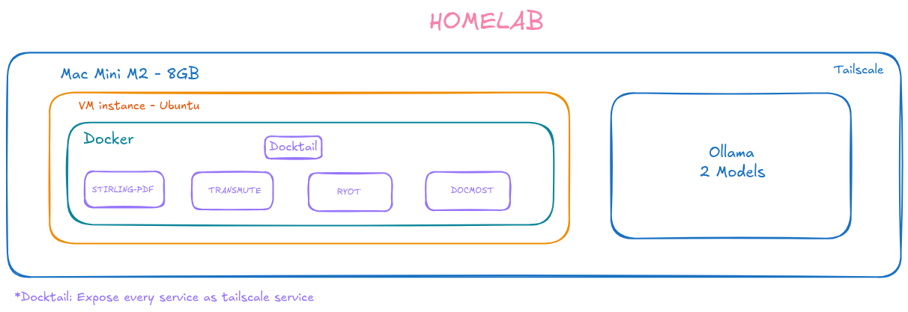

# HOMELAB

## Overview

- **Device:** Mac mini M2 (8 GB RAM).
- **Network:** Tailscale for private mesh connectivity (MagicDNS + encrypted tunnels).
- **Primary services:** `ollama` (local LLM). Docker services (`stirling-pdf`, `transmute`, `ryot`, `docmost`) run inside a VM on the Mac (Orbstack).
- **Exposure:** Services are reachable over Tailscale — either by publishing host ports to the Tailscale interface or using Tailscale Serve / HTTP advertising. Other Tailscale nodes can reach services via MagicDNS names or node IPs.

## Services

- `ollama`: Local LLM inference service. Hosts models locally and exposes an API for text generation, embeddings, and other model inference tasks.
- `stirling-pdf`: PDF processing service — converts, extracts text/metadata, performs OCR or PDF generation tasks used by document workflows.
- `transmute`: Self-hosted file converter and compressor (https://transmute.sh/) — converts images, video, audio, documents, 3D models, fonts and more using a REST API and web UI. Runs in Docker (default port 3313) and is ideal for private, on-prem file conversions and compression.
- `ryot`: Personal tracking & life-logging platform (https://ryot.io/) — dashboard-driven personal data tracker with analytics, media tracking, and a self-hosted option for keeping data private. Useful if you run personal collections or consumption telemetry locally.
- `docmost`: On-premises team wiki / knowledge base (https://docmost.com/) — collaborative, self-hosted documentation platform with real-time editing, RBAC, built-in diagramming, and an AI assistant that can connect to local LLMs (e.g. `ollama`) for search/chat over docs.

## Architecture

